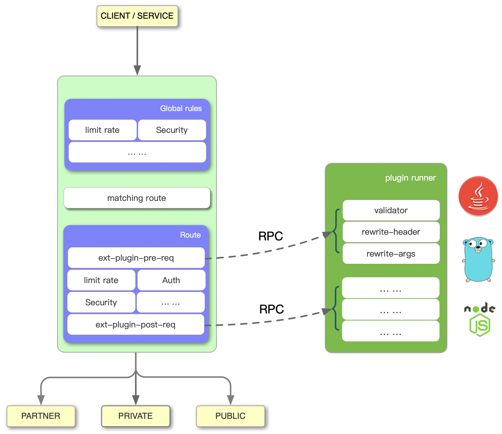

apisix-java-plugin-runner
=================

Runs [Apache APISIX](http://apisix.apache.org/) plugins written in Java.
Implemented as a sidecar that accompanies APISIX.

Status
------

This project is generally available.

Why apisix-java-plugin-runner
---------------------

APISIX offers many full-featured plugins covering areas such as authentication,
security, traffic control, serverless, analytics & monitoring, transformations, logging.

It also provides highly extensible API, allowing common phases to be mounted,
and users can use these api to develop their own plugins.

this project is APISIX Java side implementation that supports writing plugins in java.

Version Matrix
-------------

| apisix-java-plugin-runner | APISIX                                                                      |
|---------------------------|-----------------------------------------------------------------------------|
| 0.1.0                     | >= [2.7.0](https://github.com/apache/apisix/blob/master/CHANGELOG.md#270)   |
| 0.2.0                     | >= [2.12.0](https://github.com/apache/apisix/blob/master/CHANGELOG.md#2102) |
| 0.3.0                     | >= [2.15.0](https://github.com/apache/apisix/blob/master/CHANGELOG.md#2150) |
| 0.4.0                     | >= [3.0.0](https://github.com/apache/apisix/blob/master/CHANGELOG.md#300)   |
| 0.5.0                     | >= [3.0.0](https://github.com/apache/apisix/blob/master/CHANGELOG.md#300)   |
| 0.6.0                     | >= [3.0.0](https://github.com/apache/apisix/blob/master/CHANGELOG.md#300)   |

How it Works
-------------

See [How it Works](./docs/en/latest/how-it-works.md) to learn how apisix-java-plugin-runner collaborate
with APISIX to run plugins written in java.

The Internal of apisix-java-plugin-runner
---------------------------------

If you're interested in the internal of apisix-java-plugin-runner, we recommend you
to read the [the-internal-of-apisix-java-plugin-runner](./docs/en/latest/the-internal-of-apisix-java-plugin-runner.md),
it explains the details of communication and protocol conversion with APISIX.

Get Involved in Development
---------------------------

Welcome to make contributions, but before you start, please check out
[development.md](./docs/en/latest/development.md) to learn how to run and debug apisix-java-plugin-runner
in your own environment.

License
-------

[Apache 2.0 LICENSE](./LICENSE)
