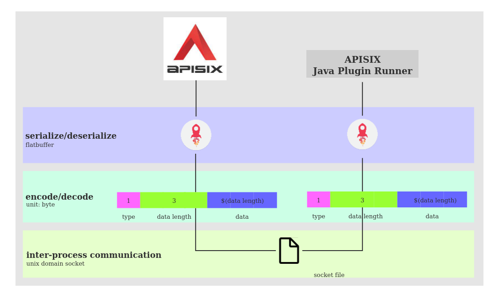

The Internal of apisix java plugin runner

This article explains the internal design of apisix-java-plugin-runner.

## Table of Contents

- [Overview](#overview)
- [Communication](#communication)
- [Serialization](#serialization)
- [Codec](#codec)

## Overview

The apisix-java-plugin-runner designed as a TCP server built using [reactor-netty](https://github.com/reactor/reactor-netty),
it provides a `PluginFilter` interface for users to implement.

Users only need to focus on their business logic, not on the details of how the apisix java plugin runner communicates with APISIX.

The inter-process communication between them is depicted by the following diagram.



## Communication

apisix-java-plugin-runner and APISIX use the Unix Domain Socket for inter-process communication,
so they need to be deployed in the same instance.

apisix-java-plugin-runner is managed by APISIX. APISIX starts the apisix-java-plugin-runner when it starts and ends it when it
ends. if the apisix-java-plugin-runner quits in the middle, APISIX will restart it automatically.

## Serialization

Refer to [flatbuffers](https://github.com/google/flatbuffers)

FlatBuffers is a cross platform serialization library architected for maximum memory efficiency.
It allows you to directly access serialized data without parsing/unpacking it first, while still having great forward/backward compatibility.

You can refer to the [ext-plugin.fbs](https://github.com/api7/ext-plugin-proto/blob/main/ext-plugin.fbs)
 schema file to see how Lua and Java layout the serialized objects.

## Codec

apisix-java-plugin-runner and APISIX use a private binary protocol for coding and decoding.
The protocol format is

```
1 byte of type + 3 bytes of length + data
```

The type can be 0 ~ 7, and the length can be [0, 8M). The length of data is determined by length.

The current type takes the following values

* 0 means error
* 1 means prepare_conf
* 2 means http_req_call

The binary data generated by the flatbuffer serialization is placed in the data segment.
